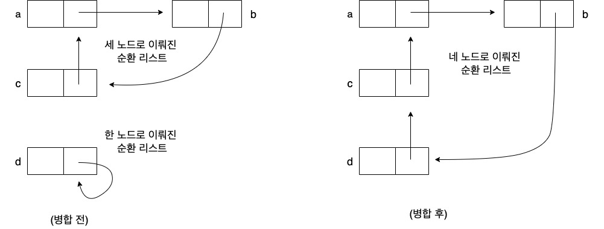

## 요약, 정리

### [Speed1] 상수 시간에 물 넣기

- 내부 클래스를 사용
    - Container클래스의 amount필드를 새로운 클래스인 Group으로 옮기면 이러한 낭비를 없앨 수 있다.
- 같은 그룹에 속하는 모든 수조는 같은 Group객체를 참조하고 이 객체에 해당 그룹에 속하는 수조에 담긴 물의 양을 저장한다.
- Speed1 구현에서 Container클래스의 필드는 하나뿐이다.

### [Speed2] 상수 시간에 연결 추가하기

1. 시간 복잡도

|메서드| 시간 복잡도 |
|---|--------|
|getAmount| O(1)   |
|connetTo|O(n)|
|addWater|O(1)|

- connectTo 메서드의 두 단계 모두 선형 시간이 소요된다.
    1. addAll 메서드를 이용해 두 그룹의 요소를 병합하기
    2. 나머지 한 그룹에 속하는 수조들의 그룹을 변경하기
- 첫 번째 단계는 집합을 연결 리스트로 대체해 두 컬렉션을 병합하는 연산을 상수 시간으로 줄이면 속도를 쉽게 개선할 수 있다.
- connectTo를 상수시간으로 만드려면 아래의 기법 사용

2. connectTo의 복잡도를 상수시간으로 줄이는 수조클래스 구현
    1. 병합 연산을 상수 시간에 수행할 수 있는 자료 구조를 이용해 연결된 수조의 그룹을 표현한다.
        - 순환 연결리스트를 직업 구현해야함.
    2. 물의 양을 갱신하는 작업을 최대한 나중으로 미룬다.
    3. 순환리스트로 그룹 표현
        - 순환 연결 리스트는 각 노드가 순환하는 형태로 다음 노드를 가리키는 노드로 이뤄진다.
        - 머리나 꼬리 개념 존재x
        - 빈 순환 연결 리스트는 다음 노드로 자신을 가리킴.
        - 서로 다른 리스트에 속하는 두 노드가 주어졌을 때 단일 연결만으로도 두 리스트를 상수 시간에 병합 할 수 있다는 점이다.
          
        - 이 방법은 주어진 두 노드가 서로 다른 리스트에 속할 때만 제대로 작동한다. 두 도느가 같은 리스트에 속하면 참조를 서로 바꿈으로써 거꾸로 한 리스트를 2개 리스트로 나눈다. 따라서 Novice구현과 같은 문제가 발생한다.(?)
3. 갱신 지연
- 지연성은 필요한 시점까지 계산을 미루는 아이디어를 말한다.

### [Speed3] 최적의 균형: 합집합 찾기 알고리즘

- 부모 포인터 트리(따로 정리해보기)
    - 부모 포인터 트리는 각 노드가 부모 노드 하나만 가리키는 식으로 데이터가 연결된 자료 구조다.

- 그룹 대표 찾기
    - 트리 연산을 수행할 때 다음 2가지 기법을 적용
        1. find 연산: 경로 압축(path comparison) 기법
        2. union 연산: 크기에 따른 연산(link-by-size) 정책

## 전혀 새로운 문제에 적용해보기

### 3장은 성능 향상 기법
1. 빠른 삽입

2. 빠른 조회

3. 모든 것을 빠르게

### 요약

- 같은 클래스더라도 여러 가지 방법으로 성능을 최적화할 수 있다.
    
- 사용량 프로파일을 바탕으로 클래스가 수행하는, 비용이 가장 많이 드는 계산을 다른 메서드로 옮길 수 있다.
    
- 순환 연결 리스트는 임의의 요소에서 시작하는 두 목록을 병합하기에 적합한 자료 구조다.
    
- 부모 포인터 트리는 union-find에 적합한 자료 구조다.
    
- 분할상환 분석은 일련의 연산을 장기적으로 수행할 때 클래스의 평균 성능을 알 수 있는 도구다.
    

돌발 퀴즈1

- 자바 프로그램에서 사용하는 클래스 사이에는 어떠한 부분 순서가 성립할까?
  - 2가지의 부분 순서
    - (a)'~의 서브 클래스' //상속에서 자식 클래스
    - (b)'~의 내부 클래스' //클래스안에 클래스를 정의한 것

돌발 퀴즈2

- 단일 순환 연결 리스트에서 주어진 노드를 제거하는 연산의 복잡도는 어떠한가?
  -  흐음..O(n)

돌발 퀴즈3

- 여러분의 삶에서 즉시 해야 할 2가지일과 최대한 지연시켜야 할 2가지 일을 생각해보자.
  - 즉시 해야 할 일 2가지 : 밥, 잠
  - 최대한 지연시켜야 할 일 : 잠?!, 게임ㅠ..

돌발 퀴즈4
- 여러분이 자바 컴파일러를 만든다고 가정해보자. 클래스 사이의 상속 관계를 트리로 나타낸다면 부모 포인터 트리와 자식 포인터 트리 중 어느 방식을 사용하겠는가?

## 고민 사항 / 중점적으로 리뷰받고 싶은 부분

_<!-- 함께 고민해주었으면 하는 부분 -->_
3.2 speed2 순환리스트로 그룹 표현하기 부분에서 Novice구현과 같은 문제??가 뭔지 모르겠습니다. 