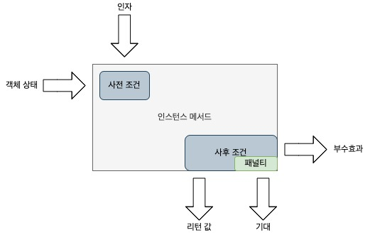
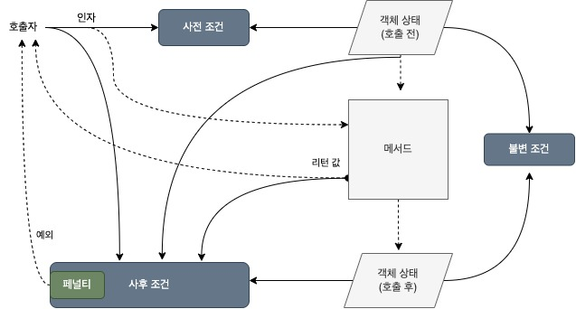
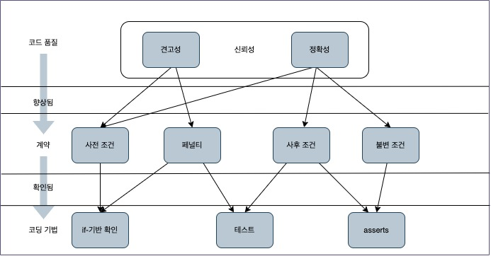
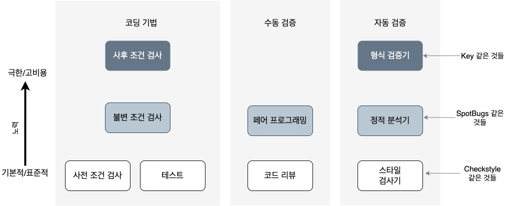

## 요약, 정리

<details>
<summary>5장에서 다루는 내용</summary>
<div>


- 계약 형태로 메서드 명세 작성하기
- 런타임에 계약 준수 강제하기
- 어서션 사용하기
- 사후 조건의 가벼운 대안으로서 클래스 불변 조건 확인하기

</div>
</details>

소프트웨어의 신뢰성은 다양한 작동 환경에서 시스템이 원하는 대로 작동하는지를 말한다.

5장에서는 소프트웨어의 일부에 기대했던 동작을 정의하는 방법 즉 명세를 작성하는 방법을 알아본다.

### 5.1 계약에 의한 설계
- 계약에 의한 설계방법론에서는 소프트웨어의 구성품 특히 메서드마다 계약을 부과한다.
- 메서드 계약은 사전 조건(precondition)과 사후 조건(postcondition), 패널티(penalty)로 이뤄진다.

### 5.1.1 사전 조건과 사후조건
#### 1. 사전조건
- 사전조건은 메서드가 올바로 기능하는 데 필요한 요구 사항을 말한다.
- 그리고 피라미터의 적법한 값과 현재 객체의 적법한 상태를 기술한다.
  - ex) 제곱근을 구하는 메서드의 사전 조건은 주어진 인자가 음수가 아닌 수여야 한다.
- 사전 조건은 호출자가 완벽하게 제어할 수 있는 성질의 조건만 포함해야한다.
  - ex) 파일 이름을 인자로 받는 메서드의 경우 주어진 파일이 존재해야 한다는 조건은 사전 조건에 포함될 수 없다. 
  - 파일이 존재하는지 호출자가 100% 확신할 수 없기 때문이다.
  - 이러한 경우 메서드에서 예외를 던질 수 있지만 그 예외는 호출자의 처리를 강제하는 확인된 예외여야 한다.

#### 2. 사후조건
- 메서드의 효과와 리턴 값, 관계된 모든 객체의 상태 변화를 기술한다.
- 잘 설계된 클래스라면 메서드 호출 후의 변화는 해당 객체에만 한정돼야 한다.
- 그렇지 않은 경우도 있는데 예를 들어 수조 예제의 connectTo메서드는 의도한 효과를 달성하기 위해 여러 수조의 상태를 변경해야 한다.
- 사후조건은 호출자가 사전 조건을 어겼을 때 어떠한 일이 발생하는지 즉 패널티도 명시해야 한다.
- 자바에서 주로 사용하는 페널티는 확인되지 않은 예외를 던지는 것이다.



위의 그림은 인스턴스 메서드의 계약을 시각적으로 설명한다.

```
순수 메서드와 부수효과
- 순수 메서드(pure method)는 값만 리턴하는 메서드를 말한다.
- 부수효과(side effect)는 화면 출력과 인스턴스 필드 수정을 비롯한 기타 모든 결과를 말한다.
- 참조 투명성(referential transparency)이란 같은 인자로 순수 메서드를 두 번 호출하면 그 결과도 같아야하는 성질을 말한다.
- 하스켈(Haskell)이나 스킴(Secheme)을 비롯한 함수형 언어(functional language)는 순수 메서드와 참조 투명성 개념을 바탕으로 한다.
```

위의 설명한 것들의 예시를 들자면 예를 들어 java.util.Iterator 인터페이스의 next메서드의 계약은 다음과 같다.
1. 사전 조건 : 반복자(iterator)가 끝에 다다르지 않았다. 즉 hasNext가 true를 리턴한다.
2. 사후 조건 : 반복 순서상 다음 차례의 항목을 리턴하고 반복자는 한자리 전진한다.
3. 페널티 : 사전 조건이 성립하지 않으면(확인되지 않은 예외) NoSuchElementException을 던진다.
- 반복자가 끝에 다다른 상태에서 next를 호출하는 것은 사전 조건 위반이며 클라이언트 측의 오류다.(오류가  next메서드 밖에 있다.)
- 반대로 next 구현에서 반복자를 전진시키지 않으면 사후 조건 위반이다.

다음 그림은 메서드 계약을 이루는 요소 사이의 데이터 의존성을 보여준다.



**사전 조건**은 인자의 적법한 값과 객체의 메서드 호출 전 상태를 기술한다. '사전 조건'상자로 두 화살표가 향하는 것이 이를 나타낸다.

Iterator::next 메서드에는 인자가 없으므로 **사전 조건**은 **반복자의 상태**만 명시한다.

**사후 조건**은 메서드 호출로 야기되는 모든 변화를 기술하므로 다음과 같은 데이터를 언급한다.
- 리턴값(메서드의 주요 효과)
- 객체의 이전상태와 새로운 상태 : 이전 상태는 메서드의 동작에 영향을 미치는 입력이고 새로운 상태는 메서드로 인한 결과 중 하나이다.
- 입력으로 주어진 인자의 값
- System.out.println 호출처럼 전역적으로 접근 가능한 객체나 정적 메서드로 인한 부수효과

### 5.1.2 불변 조건
- 불변 조건은 클래스 필드에 대해 **항상 참인 조건**을 말한다.
- 메서드가 실행되는 동안 클래스가 변화하는 동안을 제외하고 항상 성립해야 한다.
- 불변 조건은 특정 시점의 객체 상태를 기술하는 **정적 일관성 규칙**(static consistency rule)이다.
- 반면 사후 조건은 메서드 실행 전후의 객체 상태를 비교하므로 동적 일관성 규칙(dynamic consistency rule)이다.
- 불변 조건은 메서드 실행 전후 항상 성립해야한다. 따라서 위의 그림에서 객체의 이전 상태와 새로운 상태로부터 불변 조건으로 향하는 화살표가 존재한다.

### 5.1.3 정확성과 견고성
- 소프트웨어 신뢰성은 정확성과 견고성 2가지 품질로 세분화할 수 있다.
- **정확성**을 측정할 때는 시스템이 정상환경이라고 가정한다. 즉 기대한 환경이 주어진다는 가정하에 시스템이 계획대로 작동한다는 뜻이다.
- **견고성**은 예외적이고 예상하지 못한 환경에서 시스템이 어떻게 동작하는지를 다룬다.
- 예를 들어서 컴퓨터 메모리나 디스크가 모자라거나 외부에서 주어진 입력의 형식이나 범위가 틀린 경우 사전 조건이 깨진 상태에서 메서드가 호출되는 상황이다.



위의 그림은 신뢰성을 이루는 2가지 소프트웨어 품질과 앞에서 다룬 여러 가지 명세, 5장과 6장에서 사용할 3가지 코딩 기법 사이의 관계를 요약해 보여준다.

- 정확성은 계약과 사전,사후 조건의 비교와 클래스 불변 조건을 바탕으로 정의된다.
- 견고성은 페널티와 사전 조건을 바탕으로 정의된다. 

계약을 구현하고 강제하는 데 도움을 주는 코딩 기법은 다음과 같다.
- 일반적인 if 기반 검사는 호출자가 사전 조건을 지키는 방식으로 메서드를 호출했는지 확인하고 그렇지 않으면 페널티를 발생시킨다.
- assert 구문은 사전 조건과 불변 조건을 확인하는 데 유용하며 안전이 중요한 소프트웨어에서 특히 쓸모 있다.
- 테스트는 소트프웨어의 신뢰성에 대한 확신을 높여줄 수 있으며 주로 사후 조건을 검사하고 페널티르 발생시킨다.

### 5.1.4 계약 검사 
프로그램 오류의 상당수는 메서드 사전 조건 위반에서 비롯된다.

런타임에 사전 조건을 확인해야하고 사전 조건을 어기면 적절한 예외를 던져주는 것을 방어적 프로그래밍이라고 한다.

주로 사용하는 예외 클래스
- IllegalArgumentException : 인자 값이 사전 조건을 위반함
- IllegalStateException : 현재의 객체 상태가 호출된 인스턴스 메서드와 호환되지 않거나 주어진 인자 값과 호환되지 않을 경우. 이미 닫힌 파일에 읽기를 시도하면 이러한 예외가 발생


계약에 의한 설계는 어떠한 검사가 항상 수행돼야 하는지 간단한 기준을 제공한다.
- public 메서드의 사전 조건은 항상 확인해야 하므로 if를 이용한다.
- 사후 조건과 불변 조건, public이 아닌 메서드의 사전 조건을 비롯한 다른 모든 확인은 개발하는 동안에만 수행한다. 따라서 어서션을 이용한다.

사전 조건 위반은 메서드 계약을 준수하지 않는 클라이언트 때문에 발생한다.

### 5.1.5 더 큰 그림
아래의 그림은 5장과 6장에서 다룰 기법을 더 넓은 관점에서 조망한다.
이 책은 프로그래머가 매일 활용할 수 있는 프로그래밍 기법과 스타일에 초점을 맞춘다.



1. 수동검증(human oversight) : 동료 개발자가 회사 표준에 따라 여러분의 코드를 검증하는 것이다.
   - 이러한 검토를 두 동료 사이에 지속적으로 수행할 수 있는데 이 것을 페어 프로그래밍이라고 한다.
2. 자동검증 : 일부 소프트웨어 도구를 이용하면 컴파일러가 수행하는 확인에 대해 코드 속성을 자동으로 검증할 수 있다. 이러한 도구는 3가지로 나눌 수 있다.
   - 스타일 검사기(style checker) : 가독성과 통일성을 목적으로 하며 상대적으로 표면적인 속성을 검사하는 도구다. 예를 들어 들여쓰기가 올바로 통일됐는지 검사하기
   - 정적 분석기(static analyzer) : 컴파일러의 타입 검사단계와 같은 의미론적 분석이 가능한 도구다. 예를 들어 익명 클래스에 호출 불가능한 메서드가 있는지 검사하기
   - 형식 검증기(formal verifier) : 주어진 모든 값의 집합에 대해 프로그램 실행을 시뮬레이션할 수 있다. 예를 들어 정수 변수가 음수가 될 수 있는지 검사하기
 
조직과 과업에 따라 어떤 도구를 선택할지가 달라진다. 비디오게임 개발과 헬스케어 분야 고객의 요구는 완전하게 다르기 때문이다.

### 5.2 계약을 바탕으로 수조 설계하기
이제 계약에 의한 설계를 적용해 수조를 설계하고 Reference구현에 반영해보자.
메서드 계약을 표 5.1과 같이 정리한다.
- Container 메서드의 계약

| 메서드 | 사전 조건 | 사후 조건 | 페널티 |
| --- | --- | --- | --- |
| getAmount | 없음 | 현재 수조에 담긴 물의 양을 리턴함 | 없음 |
| connectTo | 인자는 null이 아님 | 두 그룹의 수조를 병합하고 물을 재분배함 | NPE |
| addWater | 인자가 음수이면 그룹에 충분한 물이 존재해야함 | 그룹의 모든 수조에 같은 양의 물을 분배함 | IAE |

NPE = NullPointerException<br/>
IAE = IllegalArgumentException

1장의 설명과 달리 계약은 사전 조건과 그에 따른 페널티도 함께 기술한다.
- connectTo의 인자는 null이 아니어야 하고 그렇지 않으면 NullPointerException을 던진다.
- addWater를 음수 인자 -x로 호출했을 때 수조에 연결된 그룹에 담긴 물의 양은 최소 x이상이어야 한다. 그렇지 않으면 IllegalArgumentException을 던진다.

인자가 null이 아니어야 한다는 사전 조건은 매우 일반적이어서 두 예외 중 어느 것을 적용해야 할지 모호할 때도 있다.
다음 상자에서 설명한다.
```
NullPointerException과 IllegalArgumentException
인자 값이 원하지 않는 null일때 NPE와 IAE중 어느 것을 던져야 하는가?

둘중 하나를 선택하는 주요 기준을 살펴보자. NPE를 사용하는 경우
- 어느 값 때문에 문제가 발생했는지 명확할 때
다음의 경우 IAE를 사용한다.
- 사전 조건 위반으로 문제가 발생한 것이 명확할 때
- JVM이 만들어내는 NPE와 명확하게 구별될 때
```

다음으로 클래스 불변 조건을 살펴볼 차례다.

일련의 적법한 연산을 수행한 후 가능한 필드값을 정의한다.Reference를 예로 들면 불변 조건은 다음과 같다.

1. 모든 수조의 amount필드는 음수가 아니다.
2. 모든 수조는 한 그룹에만 속한다.
3. 각 수조의 group필드는 null이 아니고 this 객체를 포함하는 수조를 가리킨다.
4. 같은 그룹에 속하는 모든 수조의 amount필드는 같은 값을 갖는다.

이를 바탕으로 Reference의 정확성과 견고성을 개선하자.

사전 조건과 사후 조건을 활용하는 방법은 명확하다. 앞에서 제시한 원칙에 따라 if나 어서션을 바탕으로 메서드의 처음과 끝에서 검사를 수행한다.

5.3절에서는 모든 메서드에서 사전 조건과 사후 조건을 세심하게 검사하는 Container버전을 살펴볼 텐데 이처럼 검사를 수행하는 것이 얼마나 귀찮고 큰 비용을 유발하는지 알게 될 것이다.

5장에서 다루는 Container버전은 Reference와 같은 필드를 포함하며 이를 다시 살펴보면 다음과 같다.

```java
public class Container{
    private  Set<Container> group; //현재 수조에 연결된 수조들
    private double amount; // 현재 수조에 담긴 물
}
```

### 5.3 계약을 검사하는 수조[Contracts]

5.3절에서 개발하는 Container버전은 메서드를 호출할 때마다 사전 조건과 사후 조건을 검사한다.

### 5.3.1 addWater의 계약 검사하기
- 사전 조건 : 인자가 음수일 때 그룹에 충분한 물이 존재한다.
- 사후 조건 : 그룹에 속하는 모든 수조에 같은 양의 물을 분배한다.
- 페널티 : IllegalArgumentException을 던진다.

사전 조건은 간단하게 if구문으로 확인할 수 있다.

사후 조건 검사는 제품을 배포할 때 쉽게 비활성화할 수 있도록 어서션을 이용한다.

따라서 메서드를 다음과 같이 4단계로 구성해야한다.
1. if로 사전 조건을 검사한다.
2. 나중에 사후 조건을 검사하기 위해 임시 변수에 현재 그룹에 담긴 물의 양을 저장한다.
3. 물을 추가하는 연산을 실제로 수행한다.
4. 2단계에서 저장한 데이터를 이용해 사후 조건을 검사한다.

어서션을 비활성화했을 때 사후 조건을 검사하는데 필요한 모든 시간과 공간 측면의 비용이 사라져야 한다는 설계의 목적을 상기하자.(?)
이러한 목적에 맞춰 2단계와 4단계는 어서션이 활성화됐을 때만 수행한다.

4단계는 어서션 조건 부분에서 postAddWater를 호출하면 된다.
2단계는 어서션으로 표현하기 부적절하기때문에 이를 어서션으로 바꾸려면 항상 참인 더미 비교문으로 대입 구문을 감쌀 수 있다.

다음 코드는 2단계와 4단계를 지원 메서드에 맡기는 구현 방식을 보여준다.

```java
public void addWater(double amount) {
    double amountPerContainer = amount / group.size();
    if (this.amount + amountPerContainer < 0){ //1단계 사전 조건 검사
        throw new IllegalArgumentException(
        "Not enough water to match the addWater request.");
    }
    double oldTotal = 0; //2단계-1 사후 조건 검사를 위한 데이터 저장
    assert (oldTotal = groupAmount()) >= 0; //2단계-2 더미 어서션
    for (Container c: group){ // 3단계 실제 작업 수행
        c.amount+=amountPerContainer;
    }
    assert postAddWater(oldTotal, amount) :  // 4단계 사후 조건 검사
        "addWater failed its post-condition!";
}
```

addWater구현은 두 작업을 새로운 지원 메서드에 위임한다.
groupAmount는 그룹에 속한 수조에 담긴 물의 총량을 계산하고 postAddWater는 addWater의 사후 조건을 확인하는 역할을 한다.

groupAmount의 코드는 현재 그룹에 포함된 모든 수조의 amount필드를 더해 나간다.
```java
private double groupAmount(){ // 그룹에 담긴 물의 총량을 리턴
    double total = 0;
    for(Container c: group){
        toutal += c.amount;
    }
    return total;
}
```

postAddWater 메서드는 수행할 작업을 두 단계로 나눈다.

```java
private boolean postAddWater(double oldTotal, double addedAmount){
        groupAmount() == oldTotal + addedAmount; 
        return isGroupBalanced() &&
    }// 2. 그룹에 담긴 전체 물의 양이 이전에 담겨 있던 전체 물의 양에 추가한 물의 양을 더한 것과 같은지 확인
    
private boolean isGroupBalanced(){ // 1. 그룹에 속한 모든 수조에 같은 양의 물이 담겨 있는지 확인
    for(Container x: group){
        if(x.amount != amount){
            return false;
        }
    }
    return true;
}
```

위와 같이 addWater를 구현하면 제대로 동작하지 않는다.
문제는 postAddWater에서 두 double 값을 비교하는 데서 발생한다.
부동 소수점 수로 인한 오류가 발생.

그것을 개선한 postAddWater는 다음과 같다.

```java
private boolean postAddWater(double oldTotal, double addedAmount){
        return isGroupBalanced()&&
        almostEqual(groupAmount(),oldTotal+addedAmount);
}
    private static boolean almostEqual(double x, double y){
        final double EPSILON = 1E - 4; // 반올림 오류의 감내 오차
        return Math.abs(x - y) < EPSILON; 
}
```

나머지도 다 계약 검사 하는 내용이라 읽고 넘어갔습니다.

### 요약
- 소프트웨어의 신뢰성은 명확한 명세에서 시작된다.
- 표준적인 명세는 메서드 계약과 클래스 불변 조건을 바탕으로 한다.
- 개발 과정 전체에 걸쳐 public 메서드의 사전 조건을 검사해야 한다.
- 개발이 진행 중이거나 안전성이 중요한 소프트웨어라면 필요에 따라 사전 조건과 사후 조건, 불변 조건을 검사한다.
- 어서션을 이용하면 프로그램을 실행할 때 일부 검사를 활성화하거나 비활성화할 수 있다. 


### 돌발 퀴즈 , 연습문제

[돌발퀴즈1] 페널티로 확인된 예외를 던지지 않는 이유는 무엇일까?
- 사전 조건만 준수하면 이러한 것을 방지할 수 있기때문에 라고 책이 그러네요!

[돌발퀴즈2] 프로그램이 종이를 인쇄한다면 종이가 떨어졌을 때 우아한 대처법은 무엇일까?
- 예? 우아한 대처요?

[돌발퀴즈3] "addWater에 0을 전달하면 모든 수조에 변화가 일어나지 않는다"라는 조건은 Container클래스의 유효한 불변 조건인가?
- 주어진 명제는 메서드의 호출 전후의 상태를 비교하므로 불변 조건이 아니라 사후 조건이다.

[돌발퀴즈4] 어서션이 활성화됐을 때만 불리언 플래그를 true로 설정하는 방법은 무엇일까?
- 플래그를 false로 초기화한 후 더미 어서션 안에서 true로 설정한다.

[돌발퀴즈5] addWater에 '수가 아님(not-a-number)'(Double.NAN)을 인자로 전달하면 어떻게 될까?
- 네?

## 고민 사항 / 중점적으로 리뷰받고 싶은 부분

_<!-- 함께 고민해주었으면 하는 부분 -->_

음...아직 어서션이 뭔지 모르겠습니다.